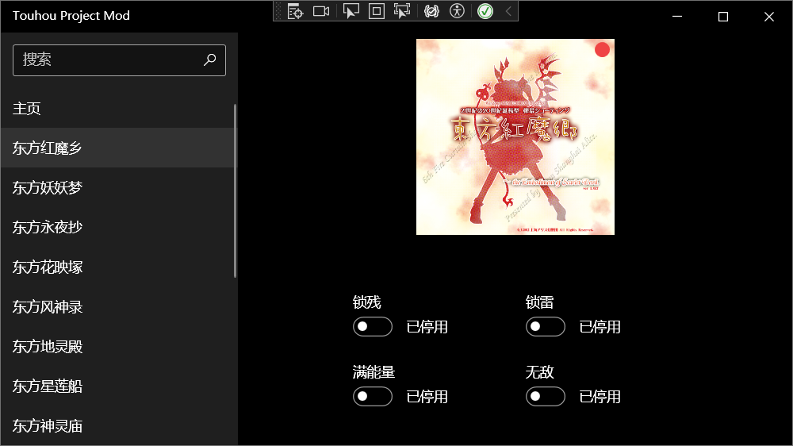

### Touhou Project Mod
该项目为 Touhou Project (整数作) 提供四项基础功能修改，目前仅包含 锁残、锁Bomb、满能量及锁定能量、无敌 等基础功能，当然不仅限于此，后续功能仍在开发中敬请期待。欢迎提交 PR 或 Issues 当然也可以给个 Star

使用 C# 编写，通过外部对应用内存R/W实现功能。支持浅/深色模式，中/英/日语言，除中文外其余语言均使用机器翻译，使用Visual Stuido 2022 Preview 及 WPF开发，DONET 版本为8.0

非独立版本使用前需安装 DONET 8.0 运行时，下载地址: https://dotnet.microsoft.com/zh-cn/download/dotnet/8.0

已知问题: TH07东方妖妖梦及TH08东方永夜抄无法修改直接修改Power值否则导致游戏崩溃，故满能量及锁定能量无法启用

下载地址: Github Release

[English](README_en.md)  [日本語](README_jp.md)

TH06 东方红魔乡: 已支持 

TH07 东方妖妖梦: 已支持

TH08 东方永夜抄: 已支持

TH09 东方花映塚: 不支持(无可修改项)

TH10 东方风神录: 已支持

TH11 东方地灵殿: 已支持

TH12 东方星莲船: 已支持

TH13 东方神灵庙: 已支持

TH14 东方辉针城: 已支持

TH15 东方绀珠传: 已支持

TH16 东方天空璋: 已支持

TH17 东方鬼形兽: 已支持

TH18 东方虹龙洞: 已支持

TH19 东方兽王园: 不支持(无可修改项)
