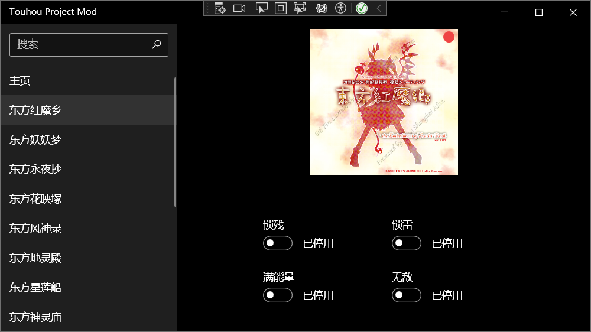

该项目为 Touhou Project (整数作) 提供四项基础功能修改，目前仅包含 锁残、锁Bomb、满能量及锁定能量、无敌 等基础功能，当然不仅限于此，后续功能仍在开发中敬请期待。欢迎提交 PR 或 Issues 当然也可以给个 Star

使用 C# 编写，通过外部对应用内存R/W实现功能。支持浅/深色模式，中/英/日语言，除中文外其余语言均使用机器翻译，使用Visual Studio 2022 Preview 及 WPF开发，DONET 版本为8.0

非独立版本使用前需安装 DONET 8.0 运行时，下载地址: <https://dotnet.microsoft.com/zh-cn/download/dotnet/8.0>

已知问题: 无。TH07东方妖妖梦与TH08东方永夜抄的「满能量」已补齐（分别对应 TH07 v1.00b / TH08 v1.00d 两个 exe 版本），如遇异常请提 Issue

下载地址: Github Release

[English](README_en.md)  [日本語](README_jp.md)

TH06 东方红魔乡: 已支持

TH06 东方红魔乡 新典: 已支持

TH07 东方妖妖梦: 已支持

TH08 东方永夜抄: 已支持

TH09 东方花映塚: 已支持 — 无敌 / Rank 锁定 / 允许多开

TH10 东方风神录: 已支持

TH11 东方地灵殿: 已支持

TH12 东方星莲船: 已支持

TH13 东方神灵庙: 已支持

TH14 东方辉针城: 已支持

TH15 东方绀珠传: 已支持

TH16 东方天空璋: 已支持

TH17 东方鬼形兽: 已支持

TH18 东方虹龙洞: 已支持

TH19 东方兽王园: 已支持 — 无敌 / 锁残 / 锁 CPU 充能

TH20 东方锦上京: 已支持

---

注意三点：**每作的补丁表只对应一个确定的 exe 版本**（文件内已注明该版本的 timeStamp 与 textSize）—— 程序会在开启开关前读取游戏 exe 的 PE 头自动核对，版本不符时拒绝写入并在页面上提示；兽王园的两个 exe 版本（v1.00a / v1.10c）偏移不同，程序会自动识别并选用对应的一套；页面上只列出该作实际拥有的机制，没有的机制不会出现死开关。

东方红魔乡 新典（New Classic）是 2026 年的独立重制版，进程名 th06nc，与上面的老红魔乡是两个不同的可执行文件，两边可以各自单独修改。它是 64 位程序，请使用 x64 版本的程序（32 位版本读不到它的模块基址，开关会点不开）。

以下 7 作（对战/格斗系作品）尚未接线：其中 4 作已取得候选偏移但均未录入程序，其余 3 作暂无可用偏移。此时的开关为不可选（置灰）状态，不会对游戏内存做任何写入。

TH07.5 东方萃梦想 (th075): 骨架已就绪(候选偏移已取得，待接入)

TH09.5 东方文花帖 (th095): 已支持 — 无敌 / 无限装填率 / 暴力取材 / 锁时

TH10.5 东方绯想天 (th105): 骨架已就绪(偏移待逆向)

TH12.3 东方非想天则 (th123): 骨架已就绪(候选偏移已取得，待接入)

TH12.5 东方文花帖DS (th125): 已支持 — 无敌 / 无限装填率 / 暴力取材 / 锁时

TH12.8 妖精大战争 (th128): 已支持 — 无敌 / 锁残 / 锁雷 / 满能量 / 锁时 / 自动B

TH13.5 东方心绮楼 (th135): 骨架已就绪(偏移待逆向)

TH14.3 弹幕天邪鬼 (th143): 已支持 — 无敌 / 无限道具 / 锁时

TH14.5 东方深秘录 (th145): 骨架已就绪(偏移待逆向)

TH15.5 东方凭依华 (th155): 骨架已就绪(候选偏移已取得，待接入)

TH16.5 秘封噩梦日记 (th165): 已支持 — 无敌 / 无限装填率 / 锁时

TH17.5 东方刚欲异闻 (th175): 骨架已就绪(候选偏移已取得，待接入)

TH18.5 弹幕狂们的黑市 (th185): 已支持 — 无敌 / 锁残 / 无限弹币 / 锁时

如遇到检测不到游戏的情况请将游戏程序名更改为th(其为作品编号)。例如东方星莲船为th12c/th12红魔乡为th06/th06c。同时请先启动游戏直到软件内对应游戏版本封面右上角红点变为绿点，此时方可使用。
